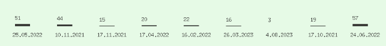
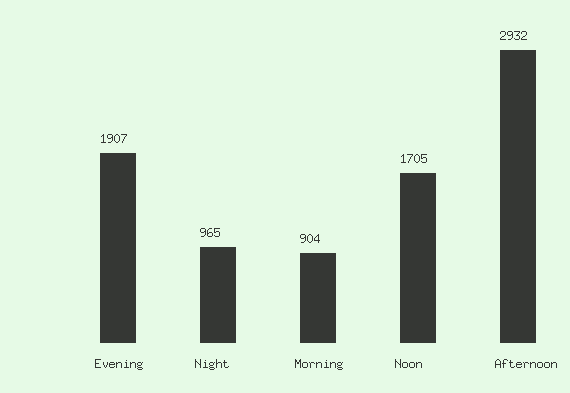

# whatsapp-analyzer

It helps you to analyze your Whatsapp chat records by combining Image Processing, Structured Chat Data and Artificial Neural Networks.
- Measure the aggression using Sentiment Analysis
- Examine the topics using Topic Detection
- Examine the chat frequency whether throughout the CLI or Visualization

And you can perform all the tasks mentioned above on any type of the data, unless it follows the same format as demonstrated in the below example.
```
[17.10.2021 16:34:18] Alice: Hey Bob! How's it going?
[17.10.2021 16:34:38] Bob: Hey Alice! I'm good, thanks. How about you?
[17.10.2021 16:35:14] Alice: I'm doing well too, thanks. Got any plans for the weekend?
[17.10.2021 16:35:20] Bob: Not much, just thinking of catching up on some reading. How about you?
[18.10.2021 02:13:46] Alice: Sounds relaxing! I'm actually thinking of going for a hike on Saturday. There's a beautiful trail I've been wanting to explore.
```

# Getting Started

1. First build the project.
    ```
    git clone https://github.com/cemasma/whatsappanalyzer
    cd whatsappanalyzer
    go build main.go -o analyzer
    pip install -r analysis_scripts/requirements.txt
    ```
2. Add the folder of app to your PATH.

    In OSX or any of Linux you can do it in terminal with this command:
    ```sh
    export PATH = "$PATH:$HOME/folderofapp"
    ```

    Follow these instructions for Windows:
    1. From the desktop, right-click the Computer icon.
    2. Choose Properties from the context menu.
    3. Click the Advanced system settings link.
    4. Click Environment Variables. In the section System Variables, find the PATH environment variable and select it.
    5. Click Edit. If the PATH environment variable does not exist, click New.
    6. In the Edit System Variable (or New System Variable) window, specify the value of the PATH environment variable. Click OK. Close all remaining windows by clicking OK.
3. You should export your chat record from Whatsapp as a txt file.
<br>For this: https://www.whatsapp.com/faq/en/android/23756533

# Build Project

1. Build the project via Go.
```sh
go build main.go
```

2. I renamed the executable as "analyzer" and I add it to paths. So I can run it anywhere. You can skip this option but remember that if you want to run project then you must be in the directory which is contains the executable.

```sh
analyzer --help
```

# Usage

After those steps you are ready to use the CLI.

```sh
analyzer --help
```

| Commands  | Description                                                                |
|-----------|----------------------------------------------------------------------------|
| help      | It shows all the commands with their abilities.                            |
| file      | For read the chat record you must send the file address with this command. While alone it returns a list of most used words.                                                                 |
| username  | You can make querying by username in Whatsapp chat.                        |
| limit     | You can limit the list from start to sended value.                         |
| start     | It sets starting index of list to sended value.                            |
| word      | Finds the count of specific word or sentence.                              |
| aggression| You can observe the aggression by users.                                   |
| topic     | It provides topics that spoken in chat and filters that by date.           |
| messagef  | It provides a graph for observe messaging frequency.                       |
| timef     | It provides a graph for observe messaging frequency in time periods.       |
| printf    | While with messagef it sorts messaging frequency by activity and prints. While with timef it prints messaging frequency in time periods.|


## Examples

* Find the most commonly used words in general.
    ```sh
    analyzer --file "chatrecord.txt"
    ```

* Find the most commonly used words in general for a person.
    ```sh
    analyzer --file "chatrecord.txt" --username "Cem Asma"
    ```

* You can adjust a limit for the word counts to display more or fewer words. If you do not set a limit, the program defaults to 10.
    ```sh
    analyzer --file "chatrecord.txt" --limit 20
    ```

* You can combine it to with user filter.
    ```sh
    analyzer --file "chatrecord.txt" --username "Cem Asma" --limit 20
    ```

* Set starting index.
    ```sh
    analyzer --file "chatrecord.txt" --start 10
    ```

* You can combine start and limit.
    ```sh
    analyzer --file "chatrecord.txt" --start 10 --limit 20
    ```

* Find the count of a specific word or sentence.
    ```sh
    analyzer --file "chatrecord.txt" --word "test"
    ```

    ```sh
    analyzer --file "chatrecord.txt" --word "hello world"
    ```

* You can measure users' aggression using Artificial Neural Network.

    ```sh
    analyzer --file "chatrecord.txt" --username "Cem Asma" --agression true
    ```

* Furthermore, you can analyze the topics discussed in the chat by the date information.

    ```sh
    analyzer --file "chatrecord.txt" --topic true
    ```
  
* You can always combine them with date filter.
    ```sh
    analyzer --file "chatrecord.txt" --date "5.30.20" --topic true
    ```

* It counts your messages per day and visualize it throughout a png image. It saves the graph image into the path you run the program.
    ```sh
    analyzer --file "chatrecord.txt" --messagef
    ```
   

    ```sh
    analyzer --file "chatrecord.txt" --username "Cem Asma" --messagef
    ```

* It prints message frequency by sorting it using message counts.
    ```sh
    analyzer --file "chatrecord.txt" --messagef --printf
    ```

* It provides a graph for observe messaging frequency in time periods.
    ```sh
    analyzer --file "chatrecord.txt" --timef
    ```
    

* It prints the messaging frequency by time periods.
    ```sh
    analyzer --file "chatrecord.txt" --timef --printf
    ```
